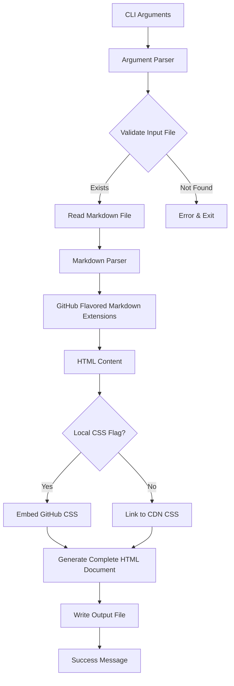

# md2html - Markdown to HTML Converter with GitHub Styling

## Overview
A Python script that converts Markdown files to HTML with authentic GitHub styling. The script accepts command-line arguments for input/output files with sensible defaults, supports Russian language content, and can embed CSS locally or use external CDN links.

## Requirements Summary
- **Input**: `.md` file from local GitHub repository (default: `README.md`)
- **Output**: `.html` file (default: `index.html`)
- **Styling**: GitHub-flavored markdown with GitHub CSS
- **Links**: Keep relative links as-is (local repository context)
- **Language**: Full UTF-8 support for Russian content
- **CSS Options**: `-l/--local` flag to embed CSS in HTML, otherwise use external CDN
- **Dependencies**: Minimal (standard library + essential packages only)

## Architecture



## Technology Stack

### Core Dependencies
| Package | Purpose | Version | PyInstaller Compatible |
|---------|---------|---------|------------------------|
| `markdown-it-py` | GitHub-flavored markdown parser | Latest | ✅ Yes |
| `github-markdown-css` | Official GitHub CSS styles | Latest | ✅ Yes (pure data) |
| `argparse` | CLI argument parsing | Built-in | ✅ Yes |
| `pathlib` | File path handling | Built-in | ✅ Yes |

### Build Dependencies
| Package | Purpose | Version |
|---------|---------|---------|
| `pyinstaller` | Create standalone executable | Latest |

### Why markdown-it-py?
- Best GFM (GitHub Flavored Markdown) compliance
- Supports tables, task lists, strikethrough, autolinks
- Extensible plugin system
- Fast and well-maintained
- Handles Unicode/Russian text correctly

## Implementation Plan

### 1. Project Structure
```
md2html/
├── md2html.py          # Main script
├── requirements.txt    # Dependencies
├── README.md           # This file (for testing)
└── plans/
    └── md2html_plan.md # This plan
```

### 2. CLI Interface Design

```bash
usage: md2html.py [-h] [-i INPUT] [-o OUTPUT] [-l] [--version]

Convert Markdown to HTML with GitHub styling

options:
  -h, --help            show this help message and exit
  -i, --input INPUT     Input markdown file (default: README.md)
  -o, --output OUTPUT   Output HTML file (default: index.html)
  -l, --local           Embed CSS locally instead of using CDN
  --version             Show version and exit
```

### 3. Core Components

#### A. Argument Parser (`parse_args()`)
- Define all CLI options with defaults
- Validate file extensions
- Handle `--version` flag

#### B. Markdown Processor (`MarkdownProcessor` class)
- Initialize `markdown-it-py` with GFM extensions
- Configure plugins: tables, tasklists, strikethrough
- Handle Unicode properly
- Convert markdown string to HTML string

#### C. HTML Generator (`HTMLGenerator` class)
- Create complete HTML5 document structure
- Inject GitHub CSS (embedded or CDN)
- Add proper meta tags for UTF-8
- Include viewport for responsive design
- Wrap content in GitHub markdown container classes

#### D. CSS Handler (`CSSHandler` class)
- Fetch GitHub CSS from `github-markdown-css` package
- Option 1: Embed full CSS in `<style>` tag
- Option 2: Link to CDN (jsdelivr/unpkg)
- Minify CSS for embedded version

#### E. Main Orchestrator (`main()`)
- Parse arguments
- Read input file (UTF-8)
- Process markdown → HTML
- Generate complete HTML document
- Write output file (UTF-8)
- Print success message with file paths

### 4. HTML Document Structure

```html
<!DOCTYPE html>
<html lang="ru">
<head>
    <meta charset="UTF-8">
    <meta name="viewport" content="width=device-width, initial-scale=1.0">
    <title>{filename}</title>
    <!-- CSS: either embedded <style> or <link rel="stylesheet"> -->
    <style>
        /* GitHub markdown CSS + custom adjustments */
    </style>
</head>
<body>
    <article class="markdown-body entry-content container-lg" itemprop="text">
        <!-- Converted markdown content here -->
    </article>
</body>
</html>
```

### 5. GitHub CSS Integration

#### Embedded Mode (`-l/--local`)
```python
# Read CSS from github-markdown-css package
from github_markdown_css import github_markdown_css
css_content = github_markdown_css()
# Minify and embed in <style> tag
```

#### CDN Mode (default)
```html
<link rel="stylesheet" 
      href="https://cdn.jsdelivr.net/npm/github-markdown-css@5/github-markdown.min.css"
      integrity="sha384-..." 
      crossorigin="anonymous">
```

### 6. Special Handling

#### Relative Links & Images
- Keep as-is (e.g., `img/logo.png`, `#о-проекте-и-его-истории`)
- No conversion needed since HTML served from same directory

#### Russian Language Support
- UTF-8 encoding for all file I/O
- `lang="ru"` in HTML tag
- markdown-it-py handles Unicode natively

#### GitHub-Specific Features
- Tables with proper styling
- Task lists (`- [ ]`, `- [x]`)
- Strikethrough (`~~text~~`)
- Autolinks
- Code blocks with syntax highlighting (via CSS only)
- Anchor links for headers

### 7. Error Handling
- File not found → clear error message
- Permission denied → clear error message
- Invalid markdown → best effort conversion
- Encoding issues → fallback with error reporting

### 8. Testing Strategy
1. Test with existing `README.md` (complex Russian content)
2. Verify all GitHub markdown features render correctly
3. Test both `-l` and default modes
4. Verify output in browser matches GitHub rendering
5. Test edge cases: empty file, only images, only links

## Implementation Steps

### Phase 1: Core Setup
1. Create `requirements.txt` with dependencies
2. Set up basic script structure with argument parsing
3. Implement file I/O with UTF-8 encoding

### Phase 2: Markdown Processing
1. Integrate `markdown-it-py` with GFM extensions
2. Configure plugins for tables, tasklists, strikethrough
3. Test conversion with sample markdown

### Phase 3: HTML Generation
1. Create HTML5 template with proper structure
2. Implement CSS embedding (local mode)
3. Implement CDN linking (default mode)
4. Add GitHub container classes

### Phase 4: Integration & Polish
1. Connect all components in `main()`
2. Add error handling and validation
3. Test with project's `README.md`
4. Verify output matches GitHub rendering

### Phase 5: Documentation
1. Create usage examples
2. Document all options
3. Add troubleshooting guide

## Acceptance Criteria
- [ ] Script runs with `python md2html.py` (uses defaults)
- [ ] Script accepts custom input/output: `python md2html.py -i docs/readme.md -o docs/index.html`
- [ ] `-l` flag embeds CSS locally (works offline)
- [ ] Default mode uses CDN (smaller HTML file)
- [ ] Russian text renders correctly
- [ ] Relative links/images work when HTML served from same directory
- [ ] Tables, task lists, code blocks match GitHub styling
- [ ] Output HTML is valid HTML5
- [ ] No external dependencies beyond requirements.txt

## PyInstaller Build Instructions

### Building Standalone Executable
```bash
# Install dependencies
pip install -r requirements.txt

# Build single-file executable
pyinstaller --onefile --name md2html md2html.py

# Or with explicit hidden imports (if needed)
pyinstaller --onefile --name md2html \
    --hidden-import=markdown_it \
    --hidden-import=github_markdown_css \
    md2html.py
```

### PyInstaller Compatibility Notes
- **markdown-it-py**: Pure Python, fully compatible
- **github-markdown-css**: Provides CSS as Python string, no binary assets
- **No external data files** needed at runtime (CSS embedded or CDN)
- **Standard library only** for file I/O and argument parsing
- **Expected executable size**: ~8-12 MB

### Verification
```bash
# Test the executable
./dist/md2html -i README.md -o test.html
./dist/md2html -l -i README.md -o test_local.html
```

## Future Enhancements (Out of Scope)
- Syntax highlighting via pygments
- Multiple input files → single HTML
- Watch mode for auto-rebuild
- GitHub API integration for remote repos
- Custom CSS themes